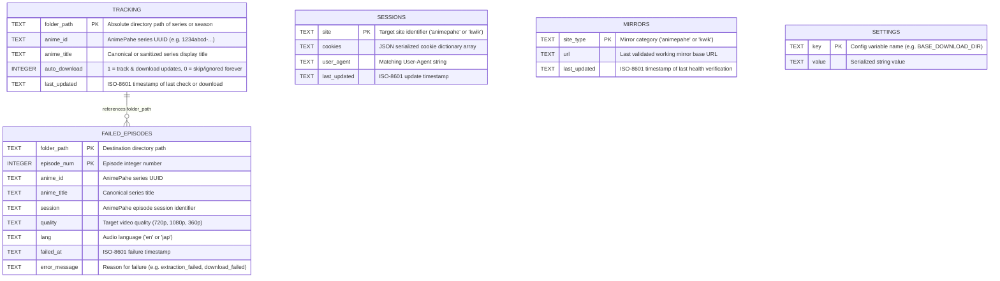
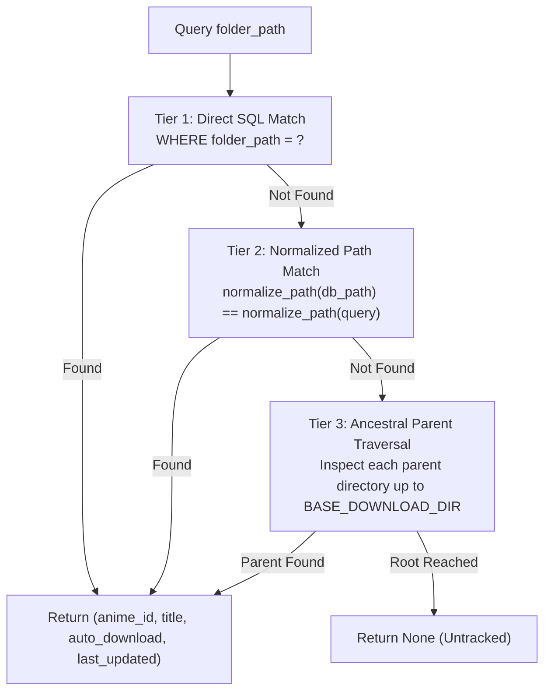
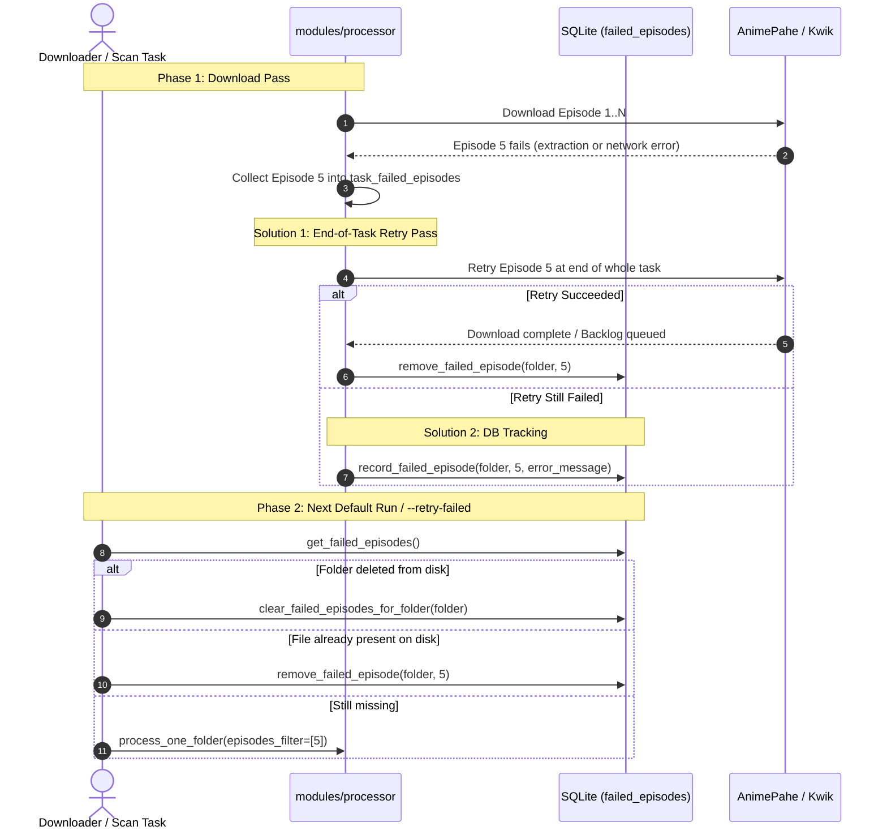

# Database Architecture & Schema Specification

This document provides the canonical technical specification for the **AnimePahe Auto-Downloader** persistence layer (`tracking.db`), detailing table schemas, constraints, indexing strategies, path resolution mechanics, Cloudflare session caching, dynamic settings overrides, and failed episode recovery lifecycle.

---

## 🏛️ Overview & Storage Model

AnimePahe Auto-Downloader utilizes an embedded **SQLite** database (`tracking.db`) situated at the root directory of the application:

```
[Project Root]/tracking.db
```
*(Configurable via `config.DB_PATH` in `config.py`)*

### Key Characteristics

- **Lightweight Connection Lifecycle**: Direct `sqlite3.connect(config.DB_PATH)` connections scoped per operation, minimizing lock contention and ensuring immediate disk commits (`conn.commit()`).
- **Idempotent Initialization**: Initialized automatically via `init_db()` upon application launch (CLI or GUI), issuing `CREATE TABLE IF NOT EXISTS` statements.
- **Dynamic Config Hydration**: On initialization, settings stored in the `settings` table are immediately queried and applied as runtime overrides over `config.py` defaults.
- **Self-Healing & Pruning**: Routine garbage collection (`cleanup_db()`) prunes tracked anime folders and failed episode records when their corresponding directories no longer exist on disk.
- **Normalization & Hierarchy-Awareness**: Path matching supports case-insensitive, slash-normalized, colon-sanitized, and ancestral parent-folder lookup to support complex season subfolder structures.

---

## 📊 Entity-Relationship Diagram



---

## 📋 Table Specifications & Schema Definitions

### 1. `tracking` (Library & Folder Tracking)

Tracks local anime directories against remote AnimePahe series IDs. Governs automated scanning, auto-download flags, and skip lists.

```sql
CREATE TABLE IF NOT EXISTS tracking (
    folder_path TEXT PRIMARY KEY,
    anime_id TEXT,
    anime_title TEXT,
    auto_download INTEGER,
    last_updated TEXT
);
```

| Column | Type | Constraints | Description |
| :--- | :--- | :--- | :--- |
| `folder_path` | `TEXT` | `PRIMARY KEY` | Absolute filesystem path of the anime or season directory. |
| `anime_id` | `TEXT` | `NULL` allowed | AnimePahe series UUID (e.g. `2b64d045-8f4b-7033-d73f-c6be4b4dc416`). `NULL` if folder was skipped without match. |
| `anime_title` | `TEXT` | `NULL` allowed | Canonical series title or user-sanitized folder name. |
| `auto_download`| `INTEGER` | `NOT NULL` | `1` = active tracking (download updates); `0` = ignored/skipped forever (`--skip-folder`). |
| `last_updated` | `TEXT` | `NULL` allowed | ISO-8601 timestamp recording the last time this directory was checked or updated. |

#### Operational Mechanics
- **Insert / Upsert**: Managed by `save_tracked(folder_path, anime_id, anime_title, auto_download, update_time=True)` using `REPLACE INTO tracking`.
- **Timestamp Refresh**: `update_last_checked(folder_path)` updates `last_updated` without modifying series metadata.
- **Directory Rename**: `rename_tracked_folder(old_path, new_path)` cascadingly updates directory references and child subfolder paths when a user renames an anime folder (e.g. appending year tags `(2024)`).

---

### 2. `failed_episodes` (Missed Episode Tracking & Recovery)

Persists episodes that failed extraction or download during previous runs so that the automated tracking task can seamlessly retry them later.

```sql
CREATE TABLE IF NOT EXISTS failed_episodes (
    folder_path TEXT,
    anime_id TEXT,
    anime_title TEXT,
    episode_num INTEGER,
    session TEXT,
    quality TEXT,
    lang TEXT,
    failed_at TEXT,
    error_message TEXT,
    PRIMARY KEY (folder_path, episode_num)
);
```

| Column | Type | Constraints | Description |
| :--- | :--- | :--- | :--- |
| `folder_path` | `TEXT` | Composite PK | Destination directory where the file should be downloaded. |
| `episode_num` | `INTEGER`| Composite PK | Integer episode index (e.g. `5`). |
| `anime_id` | `TEXT` | `NULL` allowed | AnimePahe series UUID for direct API querying. |
| `anime_title` | `TEXT` | `NULL` allowed | Series title used for notification and file naming fallback. |
| `session` | `TEXT` | `NULL` allowed | Episode session UUID used to directly resolve download links. |
| `quality` | `TEXT` | `NULL` allowed | Desired quality (e.g. `720p`, `1080p`, `360p`). |
| `lang` | `TEXT` | `NULL` allowed | Audio language preference (`en` or `jap`). |
| `failed_at` | `TEXT` | `NOT NULL` | ISO-8601 timestamp when failure was recorded. |
| `error_message` | `TEXT` | `NULL` allowed | Internal error code or message (e.g. `extraction_failed`, `download_failed`, `user_skipped`). |

#### Operational Mechanics
- **Recording**: Invoked via `record_failed_episode(...)` using `REPLACE INTO failed_episodes` when an episode fails after the end-of-task retry pass.
- **Resolution**: Invoked via `remove_failed_episode(folder_path, episode_num)` as soon as an episode is successfully downloaded, queued to My-IDM backlog, or detected as already present on disk.
- **Folder Cleanup**: `clear_failed_episodes_for_folder(folder_path)` purges all failed records when an entire folder is completed or removed.

---

### 3. `sessions` (Bypass & Browser Session Cache)

Stores Cloudflare clearance cookies and matching User-Agents for AnimePahe and Kwik to eliminate repetitive Cloudflare challenges across execution sessions.

```sql
CREATE TABLE IF NOT EXISTS sessions (
    site TEXT PRIMARY KEY,
    cookies TEXT,
    user_agent TEXT,
    last_updated TEXT
);
```

| Column | Type | Constraints | Description |
| :--- | :--- | :--- | :--- |
| `site` | `TEXT` | `PRIMARY KEY` | Target domain identifier: `'animepahe'` or `'kwik'`. |
| `cookies` | `TEXT` | `NOT NULL` | JSON-encoded array of cookie dictionaries: `[{"name": "...", "value": "...", "domain": "..."}, ...]`. |
| `user_agent` | `TEXT` | `NOT NULL` | Matching User-Agent string paired with clearance cookies (`cf_clearance`). |
| `last_updated` | `TEXT` | `NOT NULL` | ISO-8601 timestamp when session clearance was harvested. |

#### Operational Mechanics
- **Extraction & Re-use**: `get_animepahe_session()` and `get_kwik_session()` return deserialized cookie dictionaries and User-Agent headers directly consumed by `httpx.Client` or `cloudscraper`.
- **Session Flushing**: `clear_sessions()` deletes all rows to force fresh Cloudflare solving when tokens expire or become invalid (HTTP 403).

---

### 4. `mirrors` (Mirror Health & Routing Cache)

Stores the most recent operational mirror base URLs for AnimePahe and Kwik to guarantee instant, zero-latency startup without scanning mirror fallbacks sequentially on every launch.

```sql
CREATE TABLE IF NOT EXISTS mirrors (
    site_type TEXT PRIMARY KEY,
    url TEXT,
    last_updated TEXT
);
```

| Column | Type | Constraints | Description |
| :--- | :--- | :--- | :--- |
| `site_type` | `TEXT` | `PRIMARY KEY` | Site identifier (`'animepahe'` or `'kwik'`). |
| `url` | `TEXT` | `NOT NULL` | Complete working origin URL (e.g. `https://animepahe.si` or `https://kwik.cx`). |
| `last_updated` | `TEXT` | `NOT NULL` | ISO-8601 timestamp when the mirror was successfully pinged. |

#### Operational Mechanics
- On startup, `ensure_working_mirror()` and `ensure_working_kwik_mirror()` call `get_last_working_mirror(site_type)`. If the cached mirror responds with HTTP 200, it is retained immediately.
- When an active mirror goes down, rotation mechanisms select the next available candidate and invoke `save_working_mirror(site_type, url)`.

---

### 5. `settings` (Persistent Application Preferences)

Key-value configuration store that allows GUI and CLI preference adjustments to persist across runs without modifying source code in `config.py`.

```sql
CREATE TABLE IF NOT EXISTS settings (
    key TEXT PRIMARY KEY,
    value TEXT
);
```

| Column | Type | Constraints | Description |
| :--- | :--- | :--- | :--- |
| `key` | `TEXT` | `PRIMARY KEY` | Configuration attribute name (matches `config.py` attributes). |
| `value` | `TEXT` | `NOT NULL` | String-serialized configuration value (coerced dynamically to `bool`, `int`, or `str`). |

#### Operational Mechanics
- Saved via `save_setting(key, value)`.
- Loaded at initialization via `load_db_settings_into_config()`, automatically casting booleans (`'true'`, `'1'`), integers, and string types to override module attributes on `config`.

---

## 🔍 Path Resolution & Ancestral Matching Engine

To accommodate varied naming conventions, platform differences (Windows backslashes vs POSIX slashes), and multi-season folder nesting (e.g. `Frieren/Season 2/`), `get_tracked(folder_path)` utilizes a 3-tier lookup pipeline:



### Normalization Pipeline (`normalize_path`)
1. Path separators are normalized to standard forward slashes (`/`).
2. Slashes and trailing whitespace are stripped.
3. Full-width Japanese/Unicode colons (`：`) and ASCII colons (`:`) are normalized to spaces.
4. Redundant internal whitespace is collapsed.
5. Windows drive letters and paths are lowercased for case-insensitive filesystem parity.

### Ancestral Match
If a user tracks an entire series directory `D:/Anime/Kingdom` as ignored (`auto_download = 0`), creating a subfolder `D:/Anime/Kingdom/Season 5` automatically resolves to the parent entry's skip status in Tier 3, preventing unwanted auto-prompting or duplicate downloads.

---

## 🔄 Failed Episode Recovery Flow

Handling missed episodes incorporates a two-phase architecture to guarantee season completeness:



---

## 🧹 Maintenance & Self-Healing Lifecycle

### Stale Entry & Empty Folder Pruning (`cleanup_db`)
Executed automatically at the end of each library scan run:
1. Recursively prunes empty subdirectories bottom-up under `BASE_DOWNLOAD_DIR` via `cleanup_empty_folders()`, while keeping the base directory itself intact.
2. Queries all `folder_path` values in `tracking`.
3. If the directory has been moved, deleted, or pruned from disk, automatically issues:
   ```sql
   DELETE FROM tracking WHERE folder_path = ?;
   ```
4. Queries all `folder_path` values in `failed_episodes` and prunes orphans where the folder is no longer on disk:
   ```sql
   DELETE FROM failed_episodes WHERE folder_path = ?;
   ```

### Folder Rename Cascading (`rename_tracked_folder`)
When automated year tagging (`--add-years`) or user actions rename a folder (e.g. from `Jujutsu Kaisen` to `Jujutsu Kaisen (2020-)`), `rename_tracked_folder(old_path, new_path)` updates:
- The exact matching row in `tracking`.
- Any tracked nested subfolder rows sharing the old directory prefix.
